# 손에 손잡고 (Hand in Hand) 🤝

4개의 프로그래밍 언어로 동일한 서버 아키텍처를 구현하여 통합 API 엔드포인트와 로드 밸런싱을 시연하는 폴리글랏 웹 서버 프로젝트입니다.

## 🎯 핵심 목표
**Node.js**, **Python**, **Go**, **C#**으로 다음을 공유하는 동일한 웹 서버 구축:
- 동일한 REST API 엔드포인트 및 동작
- 통합 데이터 전송 포맷 (JSON-RPC 2.0)
- 공통 아키텍처 패턴
- NGINX를 통한 로드 밸런싱

## 🏗️ 아키텍처

```mermaid
graph TB
    Client[클라이언트] --> NGINX[NGINX<br/>포트 80<br/>로드 밸런서]
    
    NGINX --> Node[Node.js<br/>포트 3001]
    NGINX --> Python[Python<br/>포트 3002]
    NGINX --> Go[Go<br/>포트 3003]
    NGINX --> CSharp[C#<br/>포트 3004]
    
    Node --> Redis[(Redis<br/>캐시/세션/저장소)]
    Python --> Redis
    Go --> Redis
    CSharp --> Redis
    
    style Client fill:#fff,stroke:#333,stroke-width:2px
    style NGINX fill:#fff,stroke:#333,stroke-width:2px
    style Redis fill:#fff,stroke:#333,stroke-width:2px
    style Node fill:#fff,stroke:#333,stroke-width:2px
    style Python fill:#fff,stroke:#333,stroke-width:2px
    style Go fill:#fff,stroke:#333,stroke-width:2px
    style CSharp fill:#fff,stroke:#333,stroke-width:2px
```



## 🛠️ 기술 스택

### 공통 기술
- **HTTP 서버** - RESTful API 엔드포인트
- **SSE** - 실시간 통신을 위한 Server-Sent Events
- **JSON-RPC 2.0** - 표준화된 요청/응답 포맷
- **Swagger** - API 문서화
- **Redis** - 공유 캐시, 세션 및 영구 저장소
- **Docker** - 각 서버의 컨테이너화
- **NGINX** - 리버스 프록시 및 로드 밸런서
- **WebAssembly** - 성능이 중요한 작업 처리
- **JSON Schema** - 공유 데이터 검증

### 언어별 프레임워크

#### 🟨 Node.js (TypeScript)
- **프레임워크**: Express.js
- **JSON-RPC**: json-rpc-2.0 패키지 (가장 성숙한 구현체)
- **SSE**: Express 네이티브 지원
- **JSON Schema**: ajv 라이브러리
- **선정 이유**: 가장 큰 생태계, 풍부한 미들웨어, 검증된 안정성

#### 🐍 Python
- **프레임워크**: FastAPI
- **JSON-RPC**: jsonrpcserver 라이브러리
- **SSE**: StreamingResponse 내장 지원
- **JSON Schema**: Pydantic 내장 (JSON Schema 자동 생성)
- **선정 이유**: 현대적, 비동기 지원, 자동 문서화, 높은 성능

#### 🐹 Go
- **프레임워크**: Gin
- **JSON-RPC**: github.com/intel-go/fastjsonrpc
- **SSE**: github.com/gin-contrib/sse 미들웨어
- **JSON Schema**: github.com/xeipuuv/gojsonschema
- **선정 이유**: 뛰어난 성능, 간결한 API, 활발한 커뮤니티

#### 🔷 C#
- **프레임워크**: ASP.NET Core
- **JSON-RPC**: StreamJsonRpc (Microsoft 공식)
- **SSE**: 네이티브 IAsyncEnumerable 지원
- **JSON Schema**: Newtonsoft.Json.Schema
- **선정 이유**: 엔터프라이즈급 기능, Microsoft 지원, 포괄적인 도구

## 📁 프로젝트 구조
```
handinhand/
├── nodejs-server/      # Node.js 구현
├── python-server/      # Python 구현
├── golang-server/      # Go 구현
├── csharp-server/      # C# 구현
├── shared/
│   └── schemas/        # 공유 JSON 스키마
├── nginx/              # NGINX 설정
├── docker-compose.yml  # 멀티 컨테이너 오케스트레이션
└── README.md
```

## 🚀 빠른 시작
```bash
# 저장소 클론 및 모든 서버 시작
git clone https://github.com/yourusername/handinhand.git
cd handinhand
docker-compose up -d

# 로드 밸런싱 테스트
curl http://localhost/api/health  # 무작위로 다른 서버에 요청
```

## 📋 공통 API 엔드포인트
모든 서버가 동일하게 구현하는 엔드포인트:
- `GET /api/health` - 헬스 체크
- `POST /api/rpc` - JSON-RPC 2.0 엔드포인트
- `GET /api/events` - SSE 엔드포인트
- `GET /api/docs` - Swagger 문서

## 🔧 개발
각 서버를 독립적으로 개발 실행:
```bash
# Node.js
cd nodejs-server && npm install && npm run dev

# Python
cd python-server && pip install -r requirements.txt && python app.py

# Go
cd golang-server && go run main.go

# C#
cd csharp-server && dotnet run
```

## 📊 로드 밸런싱 테스트
NGINX는 라운드 로빈 알고리즘으로 4개 서버에 요청을 분산합니다:
```bash
# 서버 로그 모니터링
docker-compose logs -f

# 부하 테스트
ab -n 1000 -c 10 http://localhost/api/health
```

## 🎯 달성 목표
- ✅ 4개 언어에서 동일한 API 동작
- ✅ 통합 JSON-RPC 2.0 통신
- ✅ Redis를 통한 공유 캐시/세션/데이터 관리
- ✅ 로드 밸런싱 아키텍처 시연
- ✅ 간편한 배포를 위한 Docker 컨테이너화