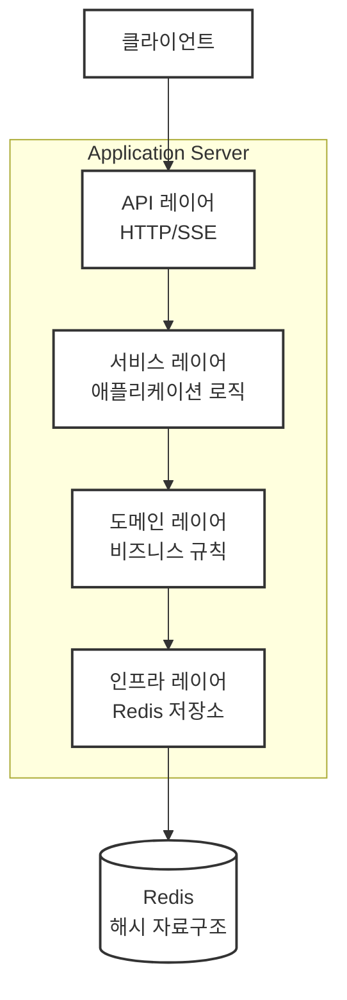
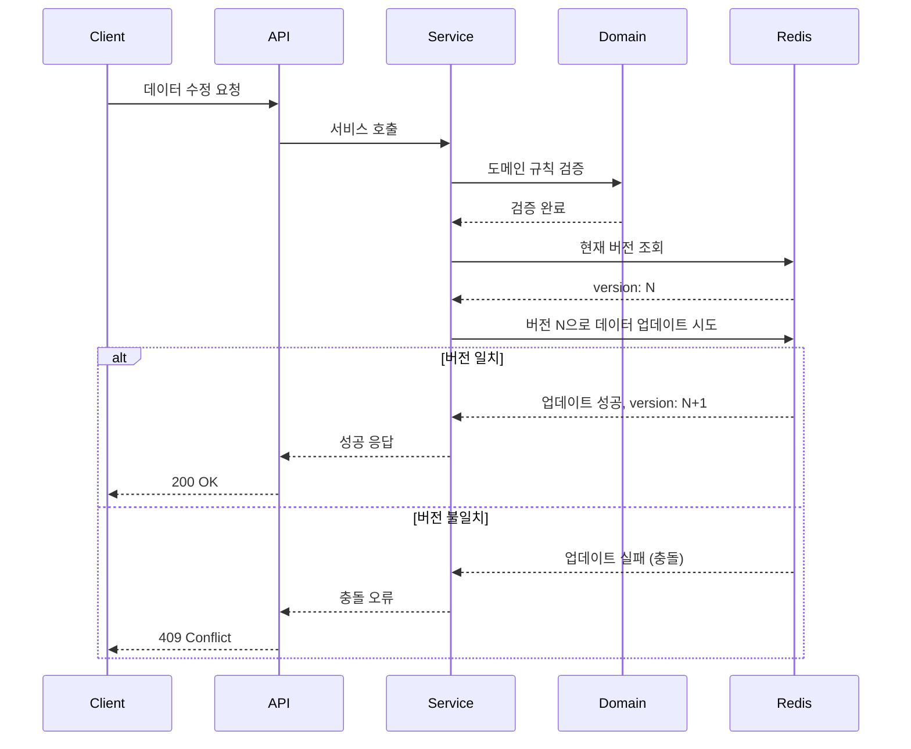

# 서버 아키텍처 설계

## 개요
게임 서버를 위한 간단한 구성의 웹 서버로 HTTP API 통신과 SSE 실시간 브로드캐스트를 지원하는 4-tier 아키텍처입니다. UserAggregates 패턴을 통해 사용자의 모든 게임 데이터를 통합 관리합니다.

## 아키텍처 구성

### 전체 시스템 구조



### 4-Tier 아키텍처

#### 1. Presentation Layer (API 레이어)
- **HTTP API**: RESTful 엔드포인트 제공
- **SSE (Server-Sent Events)**: 실시간 브로드캐스트
- **역할**: 클라이언트 요청/응답 처리, 입력 검증

#### 2. Application Layer (서비스 레이어)  
- **애플리케이션 로직**: 유스케이스 조합 및 흐름 제어
- **트랜잭션 관리**: 데이터 일관성 보장
- **역할**: 도메인 객체 조합하여 비즈니스 시나리오 구현

#### 3. Domain Layer (도메인 레이어)
- **비즈니스 규칙**: 핵심 도메인 로직과 제약사항
- **도메인 모델**: 엔티티, 값 객체, 도메인 서비스
- **역할**: 순수한 비즈니스 로직만 포함

#### 4. Infrastructure Layer (인프라 레이어)
- **Redis Repository**: 데이터 영속성 관리
- **외부 서비스 연동**: 필요시 외부 API 호출
- **역할**: 기술적 세부사항 구현

## 에러 핸들링 전략

### 명시적 에러 핸들링 원칙
**4개 언어 모든 프로젝트에서 예외(Exception) 사용 금지**

프로젝트 전체에서 Go 언어와 같은 명시적 에러 핸들링 패턴을 사용합니다. 모든 함수는 성공 결과와 에러를 명시적으로 반환하여 예측 가능하고 안전한 코드를 작성합니다.

### 언어별 에러 핸들링 인터페이스

각 언어의 관용적인 방식으로 구현하되, 다음 인터페이스를 준수합니다:

#### 필수 구현 사항
1. **함수 반환**: `(성공_데이터, 에러)` 또는 `Result<T>` 패턴
2. **에러 식별**: 에러 코드와 메시지 포함  
3. **예외 금지**: 모든 에러는 반환값으로 처리

#### Python
```python
# 튜플 반환 (Go 스타일)
def get_user(user_id: str) -> tuple[UserAggregates | None, str | None]:
    if not user_id:
        return None, "INVALID_INPUT: user_id is required"
    return user_data, None

# 사용 예시
user, error = get_user("123")
if error:
    print(f"Error: {error}")
    return
# user 사용
```

#### TypeScript (Node.js)
```typescript
// 튜플 반환
function getUser(userId: string): [UserAggregates | null, string | null] {
  if (!userId) return [null, "INVALID_INPUT: userId is required"];
  return [userData, null];
}

// 사용 예시
const [user, error] = getUser("123");
if (error) {
  console.log(`Error: ${error}`);
  return;
}
// user 사용
```

#### Go
```go
// Go 관용적 방식
func GetUser(userID string) (*UserAggregates, error) {
    if userID == "" {
        return nil, fmt.Errorf("INVALID_INPUT: userID is required")
    }
    return userData, nil
}
```

#### C#
```csharp
// 튜플 반환 (.NET 7+)
public (UserAggregates? data, string? error) GetUser(string userId)
{
    if (string.IsNullOrEmpty(userId))
        return (null, "INVALID_INPUT: userId is required");
    return (userData, null);
}

// 사용 예시
var (user, error) = GetUser("123");
if (error != null)
{
    Console.WriteLine($"Error: {error}");
    return;
}
// user 사용
```

### 공통 에러 코드 체계

#### HTTP 상태코드 기반 시스템 에러
- `400`: 잘못된 요청 (INVALID_REQUEST)
- `401`: 인증 실패 (UNAUTHORIZED)  
- `403`: 권한 없음 (FORBIDDEN)
- `404`: 리소스 없음 (NOT_FOUND)
- `409`: 충돌 (CONFLICT)
- `500`: 내부 서버 오류 (INTERNAL_ERROR)
- `502`: 외부 서비스 오류 (BAD_GATEWAY) 
- `503`: 서비스 불가 (SERVICE_UNAVAILABLE)

#### 도메인별 에러 코드 (0xAAA001 형식)

**사용자 도메인 (0x001xxx)**
- `0x001001`: 사용자를 찾을 수 없음
- `0x001002`: 닉네임 중복
- `0x001003`: 계정 생성 실패
- `0x001004`: 프로필 업데이트 실패

**인벤토리 도메인 (0x002xxx)**
- `0x002001`: 인벤토리 용량 초과
- `0x002002`: 아이템을 찾을 수 없음
- `0x002003`: 재화 부족 (골드)
- `0x002004`: 재화 부족 (젬)
- `0x002005`: 아이템 사용 불가

**게임플레이 도메인 (0x003xxx)**
- `0x003001`: 레벨 요구사항 미충족
- `0x003002`: 경험치 부족
- `0x003003`: 쿨다운 활성 중
- `0x003004`: 퀘스트 이미 완료
- `0x003005`: 퀘스트 진행 불가

**상점 도메인 (0x004xxx)**
- `0x004001`: 아이템 구매 불가
- `0x004002`: 아이템 품절
- `0x004003`: 가격 정보 없음
- `0x004004`: 할인 기간 만료

### 에러 전파 패턴

```python
# Python 예시: Repository → Service → API 에러 전파 (튜플 방식)
async def level_up_user(user_id: str, exp: int) -> tuple[UserAggregates | None, str | None]:
    # Repository 호출
    user, error = await user_repository.find_one_and_update(
        user_id,
        lambda user, _: user.add_exp(exp)
    )
    
    if error:
        return None, error  # 에러 전파
    
    return user, None

# 사용 예시
user, error = await level_up_user("123", 100)
if error:
    if error.startswith("404"):
        return {"error": "사용자를 찾을 수 없습니다"}, 404
    elif error.startswith("0x003001"):
        return {"error": "레벨 요구사항을 충족하지 않습니다"}, 400
    else:
        return {"error": "내부 서버 오류"}, 500
```

### 장점

1. **예측 가능성**: 모든 에러가 명시적으로 처리됨
2. **타입 안전성**: 컴파일 타임에 에러 처리 강제
3. **디버깅 용이성**: 에러 발생 지점과 전파 경로 명확
4. **일관성**: 4개 언어 모든 프로젝트에서 동일한 패턴
5. **성능**: 예외 처리 오버헤드 없음

## DDD (Domain-Driven Design) 적용

### 계층별 폴더 구조
```
cmd/                # 서버 애플리케이션 진입점
└── server/         # 메인 서버 애플리케이션

src/                # 소스 코드
├── api/            # API 레이어
│   ├── controllers/ # JSON RPC 컨트롤러 (핸들러 함수)
│   ├── middlewares/ # 미들웨어
│   ├── validators/  # 입력 검증
│   └── sse/        # SSE 핸들러
│
├── application/    # 서비스 레이어
│   ├── user/       # 사용자 애플리케이션 서비스
│   │   ├── services/ # 사용자 서비스
│   │   ├── usecases/ # 사용자 유스케이스
│   │   └── dto/    # 사용자 DTO
│   ├── game/       # 게임 애플리케이션 서비스
│   │   ├── services/ # 게임 서비스
│   │   ├── usecases/ # 게임 유스케이스
│   │   └── dto/    # 게임 DTO
│   └── shared/     # 공유 애플리케이션 요소
│       └── dto/    # 공통 DTO
│
└── domain/         # 도메인 레이어
    ├── user/       # 사용자 도메인
    │   ├── aggregates/ # UserAggregates (모든 게임 데이터 포함)
    │   ├── entities/ # 사용자 엔티티
    │   ├── valueobjects/ # 사용자 값 객체
    │   ├── services/ # 사용자 도메인 서비스
    │   └── repositories/ # 사용자 저장소 인터페이스
    ├── game/       # 게임 도메인
    │   ├── entities/ # 게임 엔티티 (레벨, 아이템 등)
    │   ├── valueobjects/ # 게임 값 객체
    │   ├── services/ # 게임 도메인 서비스
    │   └── events/ # 게임 이벤트
    └── shared/     # 공유 도메인 요소
        ├── valueobjects/ # 공유 값 객체
        └── events/ # 도메인 이벤트

shared/             # 4개 언어 공용 스키마
├── schemas/        # JSON Schema 정의
│   ├── UserAggregates.json    # 사용자 전체 데이터 스키마
│   ├── ProfileEntity.json     # 프로필 엔티티 스키마
│   ├── InventoryEntity.json   # 인벤토리 엔티티 스키마
│   ├── ServerConfig.json      # 서버 설정 스키마
│   └── GameConfig.json        # 게임 설정 스키마
├── config/         # 공통 설정 파일
│   ├── server-config.json     # 개발환경 서버 설정
│   ├── server-config.production.json  # 운영환경 서버 설정
│   ├── server-config.testing.json     # 테스트환경 서버 설정
│   └── game-config.json       # 게임 규칙 설정
└── README.md       # 스키마 사용 가이드
```

### 의존성 역전 원칙
- **도메인 레이어**: 어떤 레이어에도 의존하지 않음 (순수한 비즈니스 로직)
- **서비스 레이어**: 도메인 레이어에만 의존
- **API 레이어**: 서비스 레이어에만 의존  
- **인프라 레이어**: 도메인 인터페이스를 구현하여 의존성 역전
- 인터페이스를 통한 느슨한 결합으로 테스트 가능한 구조

### JSON Schema 기반 데이터 관리
**4개 언어 통합 데이터 표준**:
- **Node.js, Python, Go, C#** 모든 서버가 동일한 데이터 구조 사용
- **JSON Schema**로 데이터 검증 및 타입 안전성 보장
- **스키마 버전 관리**를 통한 하위 호환성 유지
- **자동 코드 생성**: 각 언어별 엔티티 클래스 자동 생성 가능

**스키마 적용 범위**:
- UserAggregates 및 모든 하위 엔티티
- API 요청/응답 DTO
- 이벤트 데이터 구조
- 설정 파일 형식

## Redis 데이터 모델 (게임 도메인)

### UserAggregates 패턴 (단일 필드)
```
게임 사용자 데이터 구조:
user:{userId}:data     - HASH: 모든 게임 컨텐츠 데이터 (JSON)
  └── data 필드        - 전체 UserAggregates JSON 문자열
user:{userId}:version  - STRING: 낙관적 동시성 제어용 버전
user:{userId}:metadata - HASH: 메타데이터 (최종 접속, 생성일 등)
```

### UserAggregates 코드 구조 (엔티티 멤버 변수)
```javascript
// UserAggregates 클래스 (코드 레벨에서 단일 객체로 관리)
class UserAggregates {
  constructor() {
    this.profile = new ProfileEntity();
  }
}

// 각 엔티티별 구조
class ProfileEntity {
  constructor() {
    this.nickname = "";
    this.level = 1;
    this.exp = 0;
    this.avatar = "default";
    this.createdAt = new Date();
  }
}
```

### Redis 저장 예시 (단일 필드)
```redis
# 전체 UserAggregates를 JSON으로 단일 필드에 저장
HSET user:123:data data '{
  "profile": {
    "nickname": "플레이어123",
    "level": 15,
    "exp": 2450,
    "avatar": "warrior_01"
  },
}'

# 버전 관리
SET user:123:version 1

# 메타데이터
HSET user:123:metadata lastLogin "2024-01-15T10:30:00Z" createdAt "2024-01-01T00:00:00Z"
```

### 저장소 인터페이스 정의
```javascript
class UserRepository {
  /**
   * 사용자 데이터 조회
   * @param {string} userId - 사용자 ID
   * @returns {Promise<{data: UserAggregates|null, version: number}>}
   */
  async findOne(userId) {
    const pipeline = redis.pipeline();
    pipeline.hget(`user:${userId}:data`, 'data');
    pipeline.get(`user:${userId}:version`);
    
    const results = await pipeline.exec();
    const dataJson = results[0][1];
    const version = parseInt(results[1][1]) || 0;
    
    let userAggregates = null;
    if (dataJson) {
      const parsedData = JSON.parse(dataJson);
      userAggregates = this.deserializeUserAggregates(parsedData);
    }
    
    return {
      data: userAggregates,
      version: version
    };
  }

  /**
   * 사용자 데이터 생성 또는 업데이트 (IoC 패턴)
   * @param {string} userId - 사용자 ID
   * @param {Function} createFn - 새 사용자 생성 함수: (userId) => UserAggregates
   * @param {Function} updateFn - 기존 사용자 업데이트 함수: (currentAggregates, userId) => UserAggregates
   * @param {Object} options - 옵션 {retries: number}
   * @returns {Promise<{success: boolean, data: UserAggregates, version: number}>}
   */
  async findOneAndUpsert(userId, createFn, updateFn, options = {}) {
    const maxRetries = options.retries || 3;
    
    for (let attempt = 0; attempt < maxRetries; attempt++) {
      try {
        const currentData = await this.findOne(userId);
        let newAggregates;
        let expectedVersion = currentData.version;
        
        if (currentData.data) {
          // 기존 사용자 - updateFn 실행
          newAggregates = updateFn(currentData.data, userId);
        } else {
          // 새 사용자 - createFn 실행
          newAggregates = createFn(userId);
          expectedVersion = 0;
        }
        
        const result = await this._saveWithVersionCheck(userId, newAggregates, expectedVersion);
        
        if (result.success) {
          return {
            success: true,
            data: newAggregates,
            version: result.version
          };
        }
      } catch (error) {
        if (attempt === maxRetries - 1) throw error;
      }
      
      // 재시도 전 잠시 대기 (지수 백오프)
      await this._delay(Math.pow(2, attempt) * 50 + Math.random() * 100);
    }
    
    throw new Error('FindOneAndUpsert: 최대 재시도 횟수 초과');
  }

  /**
   * 기존 사용자 데이터만 업데이트 (IoC 패턴)
   * @param {string} userId - 사용자 ID
   * @param {Function} updateFn - 업데이트 함수: (currentAggregates, userId) => UserAggregates
   * @param {Object} options - 옵션 {retries: number}
   * @returns {Promise<{success: boolean, data: UserAggregates, version: number}>}
   */
  async findOneAndUpdate(userId, updateFn, options = {}) {
    const maxRetries = options.retries || 3;
    
    for (let attempt = 0; attempt < maxRetries; attempt++) {
      try {
        const currentData = await this.findOne(userId);
        
        if (!currentData.data) {
          throw new Error(`FindOneAndUpdate: 사용자 ${userId}를 찾을 수 없습니다`);
        }
        
        const newAggregates = updateFn(currentData.data, userId);
        const result = await this._saveWithVersionCheck(userId, newAggregates, currentData.version);
        
        if (result.success) {
          return {
            success: true,
            data: newAggregates,
            version: result.version
          };
        }
      } catch (error) {
        if (attempt === maxRetries - 1) throw error;
      }
      
      await this._delay(Math.pow(2, attempt) * 50 + Math.random() * 100);
    }
    
    throw new Error('FindOneAndUpdate: 최대 재시도 횟수 초과');
  }

  /**
   * 사용자 데이터 직접 생성/업데이트 (UserAggregates 객체 전달)
   * @param {string} userId - 사용자 ID
   * @param {UserAggregates} aggregates - 저장할 데이터
   * @param {Object} options - 옵션 {retries: number}
   * @returns {Promise<{success: boolean, version: number, created: boolean}>}
   */
  async upsertOne(userId, aggregates, options = {}) {
    const maxRetries = options.retries || 3;
    
    for (let attempt = 0; attempt < maxRetries; attempt++) {
      try {
        const currentData = await this.findOne(userId);
        const isNewUser = !currentData.data;
        const expectedVersion = isNewUser ? 0 : currentData.version;
        
        const result = await this._saveWithVersionCheck(userId, aggregates, expectedVersion);
        
        if (result.success) {
          return {
            success: true,
            version: result.version,
            created: isNewUser
          };
        }
      } catch (error) {
        if (attempt === maxRetries - 1) throw error;
      }
      
      await this._delay(Math.pow(2, attempt) * 50 + Math.random() * 100);
    }
    
    throw new Error('UpsertOne: 최대 재시도 횟수 초과');
  }

  // === 내부 헬퍼 메서드 === //

  /**
   * 버전 체크와 함께 데이터 저장 (낙관적 동시성 제어)
   * @private
   */
  async _saveWithVersionCheck(userId, aggregates, expectedVersion) {
    const multi = redis.multi();
    multi.watch(`user:${userId}:version`);
    
    const serializedData = JSON.stringify(this._serializeUserAggregates(aggregates));
    const newVersion = expectedVersion + 1;
    
    multi.hset(`user:${userId}:data`, 'data', serializedData);
    multi.set(`user:${userId}:version`, newVersion);
    multi.hset(`user:${userId}:metadata`, 'lastModified', new Date().toISOString());
    
    const result = await multi.exec();
    
    return {
      success: result !== null,
      version: newVersion
    };
  }

  /**
   * 지연 함수
   * @private
   */
  async _delay(ms) {
    return new Promise(resolve => setTimeout(resolve, ms));
  }

  /**
   * UserAggregates 직렬화
   * @private
   */
  _serializeUserAggregates(aggregates) {
    return {
      profile: aggregates.profile,
    };
  }

  /**
   * UserAggregates 역직렬화
   * @private
   */
  deserializeUserAggregates(data) {
    const userAggregates = new UserAggregates();
    
    if (data.profile) Object.assign(userAggregates.profile, data.profile);
    
    return userAggregates;
  }
}
```

## 동시성 제어

### 낙관적 동시성 제어 (Optimistic Concurrency Control)

#### IoC 기반 구현 방식
게임 서버에서는 Inversion of Control 패턴을 기본값으로 사용하여 데이터 수정을 처리합니다.

#### 핵심 메서드
```javascript
// 새 사용자 생성 또는 기존 사용자 업데이트
findOneAndUpsert(ctx, createFn, updateFn, options)

// 기존 사용자 업데이트만
findOneAndUpdate(ctx, updateFn, options)
```

#### 함수 시그니처
- **createFn**: `(ctx) => UserAggregates` - 새 사용자 생성 로직
- **updateFn**: `(currentAggregates, ctx) => UserAggregates` - 기존 데이터 수정 로직
- **ctx**: 요청 컨텍스트 (userId, requestId 등)
- **options**: 추가 옵션 (재시도 횟수, 타임아웃 등)

#### 프로세스 플로우


#### 구현 예시

##### UserRepository 사용 예시
```javascript
const userRepository = new UserRepository();

// 1. FindOne - 사용자 데이터 조회
const userData = await userRepository.findOne('123');
if (userData.data) {
    console.log('사용자 레벨:', userData.data.profile.level);
}

// 2. FindOneAndUpsert - 새 사용자 생성 또는 기존 사용자 업데이트
const levelUpResult = await userRepository.findOneAndUpsert(
    '123',
    
    // createFn - 새 사용자 생성
    (userId) => {
        const newUser = new UserAggregates();
        newUser.profile.nickname = `Player_${userId}`;
        return newUser;
    },
    
    // updateFn - 레벨업 처리
    (currentAggregates, userId) => {
        const updatedAggregates = Object.assign(new UserAggregates(), currentAggregates);
        
        const newExp = updatedAggregates.profile.exp + 100;
        const newLevel = Math.floor(newExp / 1000) + 1;
        
        updatedAggregates.profile.exp = newExp;
        updatedAggregates.profile.level = Math.max(newLevel, updatedAggregates.profile.level);
        updatedAggregates.statistics.totalPlayTime += 1;
        
        return updatedAggregates;
    },
    
    { retries: 5 }
);

// 3. FindOneAndUpdate - 기존 사용자 업데이트만
const inventoryResult = await userRepository.findOneAndUpdate(
    '123',
    (currentAggregates, userId) => {
        const updated = Object.assign(new UserAggregates(), currentAggregates);
        updated.inventory.gold += 1000;
        return updated;
    }
);

// 4. UpsertOne - UserAggregates 객체 직접 전달 (생성/업데이트)
const modifiedUser = Object.assign(new UserAggregates(), userData.data);
modifiedUser.settings.language = 'en';
const upsertResult = await userRepository.upsertOne('123', modifiedUser);
console.log('새로 생성됨:', upsertResult.created);
```

## API 엔드포인트 설계

### JSON RPC 2.0 API (게임 서버)
```
POST   /api/jsonrpc                          # JSON RPC 2.0 엔드포인트

Methods:
- getUserAggregates                           # UserAggregates 전체 조회
```

### API 문서화 (OpenRPC 표준)

**4개 언어 공통 문서화 전략:**
- **OpenRPC Specification 사용**: JSON RPC 2.0 전용 표준 스펙
- **Swagger UI 스타일 인터페이스**: 웹 브라우저에서 API 테스트 가능
- **언어 중립적 스키마**: 단일 `openrpc.json` 파일로 모든 서버 문서화
- **자동 클라이언트 생성**: OpenRPC 스키마에서 클라이언트 SDK 자동 생성

#### OpenRPC 문서 구조
```json
{
  "openrpc": "1.2.6",
  "info": {
    "title": "Hand in Hand Game Server API",
    "version": "1.0.0",
    "description": "게임 서버 JSON RPC 2.0 API"
  },
  "servers": [
    {
      "name": "Development Server",
      "url": "http://localhost:3002/api/jsonrpc"
    }
  ],
  "methods": [
    {
      "name": "getUserAggregates",
      "description": "사용자 전체 데이터 조회",
      "params": [
        {
          "name": "userId",
          "description": "조회할 사용자 ID",
          "schema": {"type": "string"},
          "required": true
        }
      ],
      "result": {
        "name": "UserAggregates",
        "description": "사용자 프로필 + 인벤토리 데이터",
        "schema": {"$ref": "#/components/schemas/UserAggregates"}
      },
      "errors": [
        {"code": -32602, "message": "Invalid params"},
        {"code": -32001, "message": "User not found"},
        {"code": -32603, "message": "Internal error"}
      ]
    }
  ],
  "components": {
    "schemas": {
      "UserAggregates": {
        "$ref": "../shared/schemas/UserAggregates.json"
      }
    }
  }
}
```

#### 문서 접근 엔드포인트
```
GET    /docs                                 # OpenRPC Playground UI
GET    /docs/openrpc.json                    # OpenRPC 스키마 파일
GET    /docs/spec                            # API 스펙 JSON
```

#### 언어별 문서 서빙 방법
- **Node.js**: `@open-rpc/server-js` + Express/Fastify
- **Python**: `openrpc-python` + FastAPI 통합
- **Go**: `go-openrpc` + Gin/Echo 미들웨어  
- **C#**: `OpenRPC.NET` + ASP.NET Core

**장점:**
- 4개 언어 모두 동일한 API 문서 UI 제공
- Swagger UI와 동일한 사용자 경험 (Try it out 기능)
- JSON Schema 기반 자동 검증
- 클라이언트 SDK 자동 생성 지원
- 버전 관리 및 API 변경 추적

#### JSON RPC 2.0 요청/응답 예시

**getUserAggregates 요청:**
```json
{
  "jsonrpc": "2.0",
  "method": "getUserAggregates",
  "params": {
    "userId": "user123"
  },
  "id": 1
}
```

**성공 응답:**
```json
{
  "jsonrpc": "2.0",
  "result": {
    "profile": {
      "nickname": "플레이어123",
      "level": 15,
      "exp": 2450,
      "avatar": "warrior_01",
      "created_at": "2024-01-01T00:00:00Z"
    },
    "inventory": {
      "items": [],
      "gold": 1500,
      "gems": 75,
      "capacity": 50
    }
  },
  "id": 1
}
```

**에러 응답:**
```json
{
  "jsonrpc": "2.0",
  "error": {
    "code": "0x001001",
    "message": "User not found"
  },
  "id": 1
}
```

### SSE 엔드포인트 (게임 서버)
```
```

## 실시간 브로드캐스트 (게임 이벤트)

### SSE 이벤트  예정


### 브로드캐스트 구현 (게임 이벤트)
```javascript
// 게임 이벤트 발행
function broadcastGameEvent(userId, eventType, eventData) {
    const event = {
        type: eventType,
        userId: userId,
        data: eventData,
        timestamp: Date.now(),
        serverId: process.env.SERVER_ID || 'server-1'
    };
    
    // 사용자별 이벤트 전송
    const userClients = sseClients.filter(client => client.userId === userId);
    userClients.forEach(client => {
        client.send(`data: ${JSON.stringify(event)}\n\n`);
    });
    
    // 전체 브로드캐스트 (특정 이벤트만)
    if (['user.levelup', 'user.achievement'].includes(eventType)) {
        sseClients.forEach(client => {
            client.send(`data: ${JSON.stringify(event)}\n\n`);
        });
    }
}

// 사용 예시: 레벨업 이벤트
broadcastGameEvent('123', 'user.levelup', {
    oldLevel: 14,
    newLevel: 15,
    nickname: '플레이어123',
    rewards: { exp: 100, gold: 500 }
});
```

## 장점

### 게임 서버 아키텍처 장점
1. **관심사 분리**: 각 계층이 명확한 책임을 가짐
2. **확장성**: 계층별 독립적 확장 가능  
3. **테스트 용이성**: 각 계층을 독립적으로 테스트 가능
4. **유지보수성**: 비즈니스 로직과 애플리케이션 로직 분리로 변경 용이
5. **재사용성**: 도메인 로직의 높은 재사용성
6. **성능**: Redis 해시 구조로 빠른 데이터 접근

### UserAggregates 패턴 장점 (단일 필드)
1. **트랜잭션 안전성**: 모든 게임 데이터가 완벽한 원자성으로 처리
2. **동시성 제어 단순화**: 단일 키만 WATCH하여 낙관적 동시성 제어 구현
3. **네트워크 효율성**: 한 번의 Redis 명령으로 전체 데이터 로드/저장  
4. **데이터 일관성**: 레벨업 시 프로필+인벤토리+통계가 모두 함께 업데이트 보장
5. **구현 단순성**: findOneAndUpsert 패턴이 매우 간단하고 직관적
6. **장애 복구**: 부분 업데이트 실패로 인한 데이터 불일치 위험 제거

### IoC 기반 동시성 제어 장점
1. **성능**: 락 없이 높은 동시성 처리
2. **유연성**: createFn/updateFn으로 다양한 비즈니스 로직 처리 가능
3. **안전성**: 함수형 접근으로 부작용 최소화
4. **확장성**: 분산 환경에서도 동작 가능
5. **재시도 로직**: 내장된 자동 재시도로 안정성 향상

## 주의사항

### 게임 서버 특화 고려사항
1. **UserAggregates 크기**: 게임 데이터가 커질 경우 Redis 메모리 사용량 모니터링 필요
2. **동시 접속자 처리**: 높은 동시성 상황에서 재시도 로직과 백오프 전략 중요
3. **데이터 일관성**: Redis 트랜잭션 특성과 ACID 보장 범위 이해 필요
4. **SSE 연결 관리**: 게임 클라이언트의 실시간 이벤트 수신을 위한 연결 상태 관리
5. **부분 업데이트 고려**: 특정 상황에서는 전체 UserAggregates 대신 부분 업데이트 필요할 수 있음
6. **이벤트 중복 처리**: 재시도 로직으로 인한 중복 이벤트 발생 방지 필요